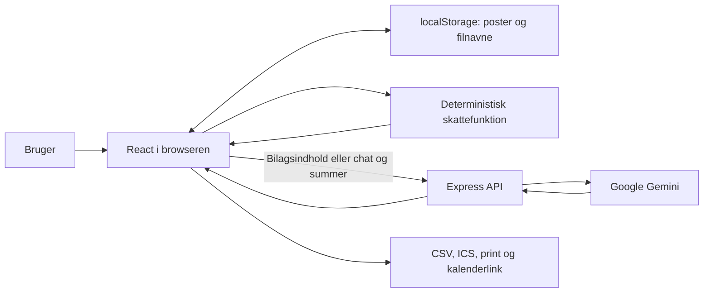

**Revisor AI — review og optimeringsplan**

Dato: 12. september 2026. Oprindeligt gennemgået revision: `d0b89ce`.

Dette dokument bevarer den oprindelige audit og begrundelsen for ændringerne. Planens kritiske punkter er efterfølgende implementeret i version 0.1.0: produktionsbuild, scannerens datakontrakt, ærlig AI-fejlhåndtering, årsversionerede skatteregler, fælles kørselsberegning, IndexedDB til data og bilag, automatisk versionshistorik, årsarkiv, komplet backup/gendannelse, diktering, adgangsbeskyttelse og automatiske regressionschecks. Linjenumre og beskrivelser af den daværende kode er derfor historiske. Den aktuelle drift og brugerrejse er beskrevet i `README.md`.

**Samlet vurdering**

Appen har et relevant og forståeligt formål: at hjælpe danske honorarmodtagere, især musikere og andre freelancere, med at registrere indtægter, dokumentere udgifter og kørsel og få overblik over skat og opsparing. Kombinationen af manuel registrering, dokumentudtræk og beregninger passer til dette behov.

Den nuværende version er en prototype. Produktionsstarten fejler, scannerens godkendelse fejler, skatteberegningen bruger forkerte/ufuldstændige årsregler, og AI-fejl skjules bag fabrikerede resultater. Disse forhold skal afklares og rettes, før resultaterne bruges til faktisk skatteindberetning. Flere produkttekster beskriver funktioner og sikkerhed, som implementeringen ikke understøtter.

Den eksisterende React/Express-struktur kan videreføres. Størst værdi ligger i korrekte regler, pålidelige data og gennemgående kontrakter mellem modulerne. En større frameworkomskrivning eller flere AI-integrationer er ikke begrundet af reviewet.

**Formål og afgrænsning**

Anbefalet produktløfte: »Saml dine honorarer og dokumenterede udgifter, få hjælp til registreringen, og se et forklarligt skatteestimat og et kontrollerbart indberetningsgrundlag.«

Første målgruppe bør være privatpersoner med danske honoraraktiviteter/B-indkomst. Appens chat inkluderer også enkeltmandsvirksomheder, men datamodel og beregninger skelner ikke mellem lønmodtager, honorarmodtager, hobby og erhvervsvirksomhed. Skattestyrelsen vurderer aktiviteter særskilt; disse kategorier bør derfor være eksplicitte, hvis flere skal understøttes. [Skattestyrelsens afgrænsning](https://skat.dk/erhverv/egen-virksomhed/afklar-virksomhedens-skatteforhold).

Kerneflowet bør være: opret profil og indkomstår → registrer/scan → ret og godkend oplysninger → dokumenter beregningen → afstem betalinger og opsparing → eksporter grundlaget.

| Område | Faktisk implementering | Anbefalet retning |
| --- | --- | --- |
| Jobs og kørsel | Manuel oprettelse, redigering, kopiering og sletning; simple km-formler | Bevar, men tilføj korrekt år, status, dokumentation og fælles kørselsregler |
| Fradrag | Fakturabeløb, procent og gemt fradragsbeløb | Skeln mellem dokumenteret udgift, erhvervsandel og skattemæssigt godkendt fradrag |
| Skat og årsopgørelse | Fælles beregningsfunktion og kopiering af rubrikbeløb | Versionsstyrede årsregler, dokumenterede forudsætninger og afstemning |
| AI-scanner | Gemini-kald, resultatvisning og defekt godkendelsesflow | AI opretter et redigerbart forslag med kildehenvisning til bilaget |
| AI-chat | Chat med aggregerede tal og indbyggede skattepåstande | Forklaring af godkendte beregninger og kildeunderbyggede regler |
| Bilagsarkiv | Filnavne; ingen lagring af dokumentets indhold | Reelt dokumentarkiv med eksport og forbindelse til poster |
| Opsparing | To manuelt indtastede summer pr. år | Årssikker tilstand og senere betalingshistorik/afstemning |
| Investeringer | Liste over udstyrskøb; indgår ikke i skatteberegningen | Klar status og senere fagligt afklaret afskrivningsflow |
| Kalender | Google Calendar-link og ICS-download | Korrekt eksport; ingen automatisk synkronisering findes i dag |
| Statistik | Bruttohonorarer og timer, grupperet efter type og jobdato | Skeln mellem arbejdsindtægt, legater, planlagte og betalte jobs |
| Roadmap | Statisk tekst med påstande om gennemførte faser | Flyt udviklingsplanen til dokumentationen og ret produktløfterne |

**Arkitektur og dataflow**

`App.tsx` ejer data, localStorage, årsvalg, navigation og CRUD. Modulerne kombinerer formularer, visning, beregninger og eksport. `server.ts` håndterer begge AI-endpoints og serverer frontend. Der er ingen database, brugerkonti, jobkø, bankforbindelse, Skattestyrelsen-integration, ruteopslag, kildeindhentning til chat eller læring af brugerrettelser.

Gode elementer at bevare: Gemini-nøglen læses på serveren; beregningerne er samlet i en funktion; AI-output vises som React-tekst; der findes manuel registrering; chatkonteksten består af summer frem for hele bogføringen. Scannerens dokumentindhold sendes dog til Google, og chatbeskeder kan selv indeholde personoplysninger.

**Fund — prioriteret efter konsekvens**

P0 betyder, at fundet blokerer pålidelig brug af en central funktion. P1 bør håndteres før brug med virkelige data eller offentlig adgang. P2 er efterfølgende kvalitets- og vedligeholdelsesarbejde. Prioriteterne er produktprioriteter, ikke CVSS-sikkerhedsvurderinger.

**F01 · P0 · Produktionsstarten crasher**

[package.json:8](</Volumes/SSD Data/Gits/Revisor/package.json:8>) bygger serveren til CommonJS, mens [server.ts:10](</Volumes/SSD Data/Gits/Revisor/server.ts:10>) bruger `fileURLToPath(import.meta.url)`. Buildet advarer om tom `import.meta`. `NODE_ENV=production npm start` fejler derefter med `ERR_INVALID_ARG_TYPE`, fordi stien er `undefined`.

Plan: vælg et konsistent serverformat, adskil frontend- og serveroutput, og lad releasekontrollen starte det færdige artefakt. Accept: clean install → typekontrol → build → produktionsstart → HTTP-kontrol lykkes i den dokumenterede Node-version.

**F02 · P0 · AI-scanneren kan ikke gemme**

[src/App.tsx:469](</Volumes/SSD Data/Gits/Revisor/src/App.tsx:469>) sender `onApplyResult`, mens scanneren i [src/components/AiBilagScannerModal.tsx:22](</Volumes/SSD Data/Gits/Revisor/src/components/AiBilagScannerModal.tsx:22>) kræver `activeIndkomstAarId`, `onAddJob`, `onAddFradrag` og `onAddInvestering`. Ingen af disse sendes. Målrettet komponentkørsel bekræfter `onAddJob is not a function` ved godkendelse.

Plan: etabler ét godkendelsesflow og én kontrakt. Fjern den konkurrerende konverteringslogik, når kontrakten er valgt. Accept: JOB, FRADRAG og INVESTERING gemmes præcis én gang på det korrekte år; UNKNOWN og ugyldige resultater kan ikke bogføres.

**F03 · P0 · AI-fejl bliver til opdigtede økonomiske oplysninger**

Ved enhver fejl i analyse-kaldet bruger [src/components/AiBilagScannerModal.tsx:145](</Volumes/SSD Data/Gits/Revisor/src/components/AiBilagScannerModal.tsx:145>) en lokal funktion, som matcher filnavn/tekst og returnerer faste resultater: fx Musikhuset Aarhus, 6.500 kr. og 96 % »sikkerhed«. Et ukendt dokument bliver i standardgrenen til Copydan, 4.800 kr. og AM-fritagelse. Funktionen læser ikke det uploadede dokuments indhold. Resultatet vises som en vellykket analyse. Kontrollen med simuleret HTTP 503 reproducerede dette.

[src/components/RevisorChatModal.tsx:87](</Volumes/SSD Data/Gits/Revisor/src/components/RevisorChatModal.tsx:87>) skjuler tilsvarende serverfejl med faste rådgivningssvar, uden at brugeren får oplyst skiftet.

Plan: afgræns eksempler til en tydelig demo, som ikke kan forveksles med brugerdata. Ved fejl skal registreringen fortsætte manuelt med tomme/ukendte felter. Accept: manglende nøgle, timeout, 429, 500 og ugyldigt JSON frembringer aldrig opfundne beløb eller en påstået sikkerhedsprocent.

**F04 · P0 · Skattesatserne og årsmodellen er ikke korrekte for 2026**

[src/data/danishTaxData.ts:31](</Volumes/SSD Data/Gits/Revisor/src/data/danishTaxData.ts:31>) indeholder ét globalt sæt satser. `calculateDanishTaxes` vælger ikke regler ud fra indkomståret. Ved kun at ændre året fra 2026 til 2025 gav kontrollen identiske resultater.

| Regel | Appen | Verificeret for 2026 |
| --- | --- | --- |
| Bundskat | 12,06 % | 12,01 % |
| Personfradrag | 51.600 kr. | 54.100 kr. |
| Progression | 15 % over 588.900 kr. | Mellemskat 7,5 % over 641.200 kr.; topskat yderligere 7,5 % over 777.900 kr.; toptopskat yderligere 5 % over 2.592.700 kr. Grænser efter AM-bidrag |
| Egen bil/MC, lavt km-trin | 3,79 kr./km | 3,94 kr./km |
| Egen cykel/knallert | 0,63 kr./km | 0,64 kr./km |

Kilder: [Skattestyrelsens skattetrin](https://skat.dk/hjaelp/bundskat-mellemskat-topskat-og-toptopskat), [personfradrag i Den juridiske vejledning](https://info.skat.dk/data.aspx?oid=1976905), [Skattestyrelsens kørselssatser](https://skat.dk/erhverv/ansatte-og-loen/koerselsgodtgoerelse/koerselsgodtgoerelse-skattepligtig-og-skattefri). Anvendelsesbetingelserne for kørsel skal vurderes sammen med satserne.

Plan: opret et regelgrundlag pr. år med kilde, ikrafttrædelse, kontroltidspunkt og versionsnummer. Brug samme grundlag i beregning, UI og chat. Historiske beregninger skal kunne reproduceres. Ukendte år må ikke stiltiende bruge et andet års regler.

**F05 · P0 · Personprofilen og beregningen dækker ikke det viste løfte**

Alle nye brugere starter med eksempelprofilen i [src/data/initialData.ts:3](</Volumes/SSD Data/Gits/Revisor/src/data/initialData.ts:3>): København, kirkemedlemskab og 80.000 kr. forventet A-indkomst i 2026. Der er ingen brugerflade til at rette profilen eller oprette nye år; `setIndkomstAarList` bruges ikke. Eksempelposter og fiktive indbetalinger gemmes automatisk som appens data.

I [src/utils/taxCalculator.ts:53](</Volumes/SSD Data/Gits/Revisor/src/utils/taxCalculator.ts:53>) og frem ignoreres pension/SU/dagpenge og enlig-forsørgerstatus. Beskæftigelses- og jobfradrag beregnes ikke, skatteloftet anvendes ikke, og A-indkomsten bruges kun i en forenklet personfradrags- og topskattefordeling. Progressiv skat fordeles forholdsmæssigt på A/B-indkomst, hvilket ikke beregner den ekstra skat fra B-indkomsten. Kontrol med 500.000 kr. i pensionsfeltet gav uændret resultat.

Plan: kræv brugerens reelle årsforudsætninger og afgræns understøttede tilfælde. Beregn ekstra skat som forskellen mellem en samlet beregning med og uden den relevante B-aktivitet, efter faglig validering af modellen. Accept: dokumenterede referenceeksempler for kun B-indkomst, blandet A/B, pension, lave indkomster og hvert progressionsknæk.

**F06 · P0 · Rubrikoversigten afspejler ikke beregningsgrundlaget**

[src/utils/taxCalculator.ts:11](</Volumes/SSD Data/Gits/Revisor/src/utils/taxCalculator.ts:11>) sætter rubrik 17 til konstant nul. Alle jobs, inklusive AM-fritagne eksempellegater, summeres i `honorarerAlt`, som vises som rubrik 12. Datamodellen kan ikke udtrykke indberetningsrubrik uafhængigt af AM-status.

Ved overskredet fradragsloft bruger motoren en begrænset sum internt, men [src/components/AarsopgoerelseModule.tsx:121](</Volumes/SSD Data/Gits/Revisor/src/components/AarsopgoerelseModule.tsx:121>) kopierer hele den ubegrænsede sum. Kontrol med 1.000 kr. honorar og 2.000 kr. fradrag gav et internt loft på 920 kr., mens feltet til rubrik 29 fortsat var 2.000 kr.

Plan: adskil indkomsttype, AM-behandling og rubrik. Returner registreret, anvendt og afvist/afklaringskrævende fradrag særskilt. Eksport, chat og skattevisning skal bruge samme fagligt godkendte resultat.

**F07 · P1 · Skattepåstande er for kategoriske og kræver faglig afklaring**

Prompten i [server.ts:69](</Volumes/SSD Data/Gits/Revisor/server.ts:69>) kobler royalty, Copydan, Gramex og kunststøtte direkte til AM-fritagelse. [server.ts:194](</Volumes/SSD Data/Gits/Revisor/server.ts:194>) instruerer modellen i at være statsautoriseret revisor og kende de »præcise« regler. Hele appen gentager et ubetinget, globalt rubrik 29-loft.

Den juridiske vejledning omtaler både nettoindkomstprincippet og, at kildeartsbegrænsende praksis er underkendt ved SKM2025.490.ØLR, med et kommende styresignal. Det giver et konkret behov for at afklare aktivitet, fradragstype og gældende praksis. Dette review konkluderer ikke, at ethvert fradragsloft er bortfaldet. [Den juridiske vejledning C.C.1.2.3](https://info.skat.dk/data.aspx?oid=2048532).

AM-behandling afhænger også af indtægtens karakter og skattemæssige status. Den kan ikke dokumenteres alene ved at genkende en afsenders navn. [Den juridiske vejledning C.A.12.3](https://info.skat.dk/data.aspx?oid=1976913).

Plan: få en skattefaglig gennemgang af rubrikker, AM-fritagelser, aktivitetsafgrænsning, underskud, afskrivninger og indkomstår. Gem godkendte regler med kilder. AI skal oplyse manglende forudsætninger og usikkerhed frem for at optræde med en professionel autorisation.

**F08 · P1 · Kørselsberegningen er en multiplikation uden de nødvendige regler**

[src/components/JobsModule.tsx:59](</Volumes/SSD Data/Gits/Revisor/src/components/JobsModule.tsx:59>) beregner alle transportformer som kilometer × sats × ture. Rubrik 51 gives fra første kilometer, uden daglig bundgrænse eller afstandstrin. Der er ingen samlet kilometertæller til erhvervskørslens satstrin eller kontrol for dobbelt fradrag. En passagerbetegnelse er ikke i sig selv en tilstrækkelig skatteregel.

Skattestyrelsens aktuelle side angiver nul fradrag for de første 24 km pr. dag og forskellige efterfølgende trin. Siden omtaler også forhøjede 2026-satser opdateret i juli; det illustrerer behovet for versionsstyrede kilder frem for et årstal i et variabelnavn. [Aktuelle regler og satser for befordringsfradrag](https://skat.dk/borger/fradrag/koerselsfradrag/koerselsfradrag-befordringsfradrag).

Plan: opret fælles beregning med dato, rejseformål, tur/retur-definition, aktivitet, dokumentation og relevante trin. Beregn afledte beløb fra rådata. Accept: 0/24/25/120/121 km, flere dage, ændret transportmiddel og relevante årlige satstrin testes særskilt.

**F09 · P1 · AI-kontrakten passer ikke til appens datamodel**

Serveren returnerer `lokationAdresse`, `CAR`/`BIKE` og `forslagFradragsprocent`; appen forventer `destinationAdresse`, `OWN_CAR_MC`/`OWN_BIKE` og `fradragsProcent`. Serverens skema indeholder ikke `antalKm`, `antalTure` eller `koerselsFradrag`, selv om brugerfladen forventer dem. `AiExtractionResult` bruger blot `Partial<Job>` og `Partial<Fradrag>`.

`JSON.parse` er den eneste efterkontrol på serveren. Klassifikation og transport beskrives som fritekst frem for afgrænsede værdier, og der er ingen runtime-kontrol af beløb, procent, datoer eller de påkrævede felter for hver dokumenttype. Struktureret JSON sikrer ikke semantisk korrekte værdier. [Googles dokumentation om strukturerede outputs](https://ai.google.dev/gemini-api/docs/structured-output).

Plan: indfør et særskilt valideret skema til AI-forslag og en eksplicit konvertering til domænedata. Manglende datoer og timer skal være ukendte; de skal ikke udfyldes med dags dato eller standardarbejdstimer. Brugeren skal kunne rette alle betydende felter før godkendelse.

**F10 · P1 · API'et mangler adgangskontrol og styring af forbrug**

Begge Gemini-endpoints kan kaldes uden login eller anden adgangskontrol i applikationen. Serveren tillader JSON på op til 25 MB globalt og har ingen eksplicit begrænsning pr. bruger, samtidighed, chatlængde eller dagligt budget. Den sætter ikke applikationsspecifikke deadlines eller output-tokenlofter. Fejlbeskeder fra leverandøren sendes videre i `details`.

Ved offentlig adgang kan andre derfor bruge serverens AI-nøgle gennem API'et. En eventuel ekstern adgangsproxy er ikke dokumenteret i repositoryet og er ikke kontrolleret.

Plan: fastlæg privat installation eller flerbrugerprodukt. Beskyt API'et passende, valider filtype/indhold og størrelse, begræns forbrug og samtidighed, og indfør sanitiserede fejl, request-id og forbrugsregistrering. Sundhedstjekket skal skelne mellem serverens tilgængelighed og AI-funktionens parathed.

**F11 · P1 · Serverkode og sourcemaps ligger i den offentlige mappe**

[server.ts:241](</Volumes/SSD Data/Gits/Revisor/server.ts:241>) serverer hele `dist`, mens buildet lægger `server.cjs` og `server.cjs.map` samme sted. Med uændret serverkilde startet gennem TypeScript-loader i production-mode returnerede begge URL'er HTTP 200. Denne kontrol omgår kun den defekte CJS-startkommando for at isolere den statiske serveradfærd.

Plan: adskil fx `dist/client` og `dist/server`; publicér kun klientmappen. Accept: serverkode og serversourcemaps kan ikke hentes over HTTP. Fundet dokumenterer kodeeksponering; der er ikke konstateret en API-nøgle indlejret i bundlefilen.

**F12 · P1 · Data og bilag kan ikke gendannes pålideligt**

[src/App.tsx:57](</Volumes/SSD Data/Gits/Revisor/src/App.tsx:57>) læser localStorage med ubeskyttet `JSON.parse`, uden skemavalidering, migrering eller fejlhåndtering ved skrivning. En korrupt værdi kan forhindre appen i at starte. Flere faner kan overskrive hinandens fulde datasæt. Der findes ingen samlet backup/import, versionshistorik eller fortryd sletning.

Bilag gemmes kun i `bilagNavne`; dokumentets bytes bevares ikke. Alligevel lover [src/components/AarsopgoerelseModule.tsx:260](</Volumes/SSD Data/Gits/Revisor/src/components/AarsopgoerelseModule.tsx:260>) download af bilag og samlet rapport. Manuelle investeringer får endda et konstrueret bilagsnavn uden upload.

Plan: vælg lagringsmodel og gennemfør migrering af eksisterende data. Til personlig lokal brug er IndexedDB med dokumentlagring og eksport en mulighed; konti og synkronisering kræver vedvarende serverlagring og adgangskontrol. Accept: en komplet eksport kan indlæses i en tom installation og genskabe poster, dokumenter og deres relationer.

**F13 · P1 · Årsskift kan blande data; årslås er ubrugt**

[src/components/OpsparingTrackerModule.tsx:28](</Volumes/SSD Data/Gits/Revisor/src/components/OpsparingTrackerModule.tsx:28>) initialiserer lokal tilstand fra props én gang. Ved årsskift nulstilles den ikke. Kontrollen skiftede fra 2026 med 4.500/5.000 kr. til 2025 med 0/0 kr.; formularen viste og indsendte stadig 4.500/5.000 kr. til det nye år.

`laast` forekommer kun i datatyper og eksempeldata og kontrolleres ikke ved ændringer. Chatten beholder desuden historik og en gammel velkomst med tidligere tal på tværs af årsvalg.

Plan: bind formularer, chat og analyser til et eksplicit år og en dataversion. Håndhæv lås i det fælles ændringslag. Accept: årsskift under indtastning, redigering, igangværende analyse og chat kan hverken flytte eller overskrive oplysninger i et andet år.

**F14 · P1 · Beløb og status får misvisende betydning**

[src/utils/taxCalculator.ts:91](</Volumes/SSD Data/Gits/Revisor/src/utils/taxCalculator.ts:91>) beregner »indtægt efter skat« som honorarer minus skat, uden at fratrække faktiske udgifter. [src/components/SkatOverblikModule.tsx:87](</Volumes/SSD Data/Gits/Revisor/src/components/SkatOverblikModule.tsx:87>) kalder det »det reelle overskud«. Kørselsfradrag er samtidig ikke det samme som en kontant udgift.

Alle jobs tæller med som indtægt, selv om der kun findes en forventet betalingsdato og ingen betalt/aflyst-status. Investeringer påvirker hverken skat eller likviditetsopgørelse. Sidebjælken anslår gevinsten til 37 % af samtlige fradrag, inklusive passagerkørsel og eventuelt fradrag over loftet. Statistikken medregner eksempellegatet i timelønnen, selv om det ikke har timer.

Plan: definer særskilt bruttohonorar, betalinger, kontante udgifter, skattefradrag, estimeret skat, overskud og likviditet. Beregn fradragets skatteværdi som en dokumenteret forskel i skatteberegninger. Tilføj afstemningsstatus frem for at kalde alle registreringer »udbetalt« eller »godkendt«.

**F15 · P1 · Typekontrollen giver falsk tryghed**

Projektet mangler `@types/react` og `@types/react-dom`, og TypeScript kører uden `strict`/`noImplicitAny`. Den oprindelige `npm run lint` består, fordi React-komponenternes typer i praksis bliver udvandet til `any`. Tilføjelse af React-typer alene i testkopien afslørede tre fejl: scannerens forkerte prop og to anvendelser af det ukendte felt `forslagFradragsprocent`.

Plan: tilføj React-typer, adskil frontend/server-konfiguration efter behov, aktiver streng kontrol trinvist, og erstat `any` ved inputgrænser med validering af `unknown`. Kald scriptet `typecheck`; det er ikke en egentlig lintkontrol. Build/release skal afhænge af denne kontrol.

**F16 · P2 · Kalender- og CSV-eksport har konkrete formatproblemer**

[src/utils/calendarExport.ts:15](</Volumes/SSD Data/Gits/Revisor/src/utils/calendarExport.ts:15>) og `:23` bruger sidste arrangementsdag som slutdato. Endagsjobbet 14. marts eksporteres som `20260314/20260314`. ICS bruger en eksklusiv slutdato, så dette kan give forkert varighed. UID ændres ved hver eksport; fritekst escapes ikke til ICS-format, og der genereres ingen betalingspåmindelse. Kalenderknapperne i scanneren tager desuden et uvalideret `Partial<Job>` som et fuldt job. [iCalendar-specifikationen](https://datatracker.ietf.org/doc/html/rfc5545#section-3.6.1).

CSV i [src/components/JobsModule.tsx:159](</Volumes/SSD Data/Gits/Revisor/src/components/JobsModule.tsx:159>) håndterer ikke indlejrede anførselstegn eller regnearksformler sikkert. `encodeURI` på en data-URL efterlader fx `#` som fragmentmarkør. Eksporten omfatter kun udvalgte jobfelter.

Plan: validér poster før eksport; korrekt eksklusiv slutdato, stabil UID og tekstkodning; Blob-baseret CSV med korrekt quoting, dansk talformat og håndtering af formelpræfikser. Accept: danske tegn, kommaer, anførselstegn, `#`, linjeskift og flerdagsjob bevares korrekt.

**F17 · P2 · Formularer og tilgængelighed kræver oprydning**

Beløbsfelter begrænser flere steder input til hele kroner. Fradrag kan ikke angives som 0 % i den manuelle formular. Datoer valideres ikke på tværs af felter eller mod valgt år. Sletning sker straks. Modaler mangler dialogsemantik, fokushåndtering og Escape-lukning; mange labels er ikke knyttet til inputs, og flere ikonknapper mangler navn. Clipboard viser succes før den asynkrone skrivning er bekræftet.

Plan: fælles formular- og dialogkomponenter, ørepræcision, eksplicit nulhåndtering, tilgængelige statusbeskeder og fortryd sletning. Gennemfør desktop-, mobil-, tastatur- og skærmlæserkontrol. Print kræver et dedikeret layout; `window.print()` alene er ikke en gennemarbejdet rapporteksport.

**F18 · P2 · Asynkrone flows kan anvende et forældet resultat**

Scanneren tillader nye analyser, mens tidligere kald er i gang, og har ingen request-id/annullering. Et gammelt svar kan derfor erstatte et nyere resultat. Lukning nulstiller ikke resultatet. Godkendelsesknappen beskyttes ikke mod gentagne klik. ID'er bruger `Date.now()`, hvilket ikke er en garanti for unikhed ved hurtige/flere oprettelser.

Plan: eksplicit analyseforløb med tilstande, annullering, kobling til bilag og år samt engangsgodkendelse. Brug stabile UUID'er og dokumenthash til dubletkontrol. Accept: svar modtaget i omvendt rækkefølge og dobbeltklik giver ikke forkerte eller ekstra poster.

**Afhængigheder — gennemgang og anbefaling**

Der findes ingen lockfil, Node-version eller `packageManager`-binding. Derfor kan en installeret produktionsversions præcise dependency-træ ikke udledes af repositoryet. Tabellen viser en frisk opløsning af de nuværende intervaller den 12. september 2026; den er ikke en liste over verificerede produktionsversioner.

| Pakke | Deklareret → opløst i testkopien | Vurdering og plan |
| --- | --- | --- |
| react / react-dom | ^19.0.1 → 19.3.0 | Bevar og lås sammen; tilføj tilhørende typer |
| @google/genai | ^2.4.0 → 2.22.0 | Relevant server-SDK; isolér bag en lille intern adapter og kontrakttest |
| express | ^4.21.2 → 4.22.2 | Bevar som udgangspunkt; håndtér qs-fund og runtime-validering |
| dotenv | ^17.2.3 → 17.4.2 | Relevant til lokal konfiguration; validér miljøvariabler ved start |
| lucide-react | ^0.546.0 → 0.546.0 | Bruges; ny major er valgfri, ikke en løsning på kernefejl |
| motion | ^12.23.24 → 12.43.0 | Ingen imports fundet; fjern efter bekræftelse af behov |
| vite | ^6.2.3 → 6.4.3 | Dobbelt deklareret i dependencies og devDependencies; adskil udviklingsserver fra produktion |
| @vitejs/plugin-react | ^5.0.4 → 5.2.0 | Buildværktøj; bør ligge blandt devDependencies |
| @tailwindcss/vite | ^4.1.14 → 4.3.3 | Buildværktøj; bør ligge blandt devDependencies |
| tailwindcss | ^4.1.14 → 4.3.3 | Bevar og lås kompatibelt med plugin |
| autoprefixer | ^10.4.21 → 10.5.6 | Ingen konfiguration/anvendelse fundet; fjern hvis fortsat ubrugt |
| esbuild | ^0.25.0 → 0.25.12 | Bruges i serverbuild; ret outputstrategi før versionsløft |
| tsx | ^4.21.0 → 4.23.13 | Udviklingsværktøj; ikke nødvendig i det færdige produktionsartefakt |
| typescript | ~5.8.2 → 5.8.3 | Ret dækningshullerne før en større compileropgradering |
| @types/node | ^22.14.0 → 22.20.2 | Vælg dokumenteret Node-runtime og match typerne |
| @types/express | ^4.17.21 → 4.17.25 | Match Express-major; opgradér ikke alene til v5-typer |

`npm outdated` viste bl.a. Vite 8.3.0, React-plugin 6.1.1, Express 5.2.1 og TypeScript 7.0.2 som nyere hovedversioner. Der er ingen grund til at opgradere alt samtidig. Vite 6.4 modtager fortsat sikkerhedsrettelser ifølge den aktuelle supportoversigt. [Vites versionspolitik](https://vite.dev/releases).

Det online npm-audit viste **to moderate pakkefund**, `express` og det transitive `qs@6.15.3`, med to advisories på qs. Ingen high/critical-fund blev rapporteret for den friske opløsning. Begge advisories angiver rettelser i qs 6.16.0. Det ene vedrører en særlig comma-parserkonfiguration; udnyttelighed er ikke bevist i denne app. Planen er at få en rettet kompatibel dependency-opløsning, låse den og verificere parseradfærd, uden at anvende `npm audit fix --force` ukritisk. [Array-limit-advisory](https://github.com/advisories/GHSA-x5fp-wj9c-mxmx), [isBuffer-advisory](https://github.com/advisories/GHSA-4mjr-xmp4-gh2g).

Licensmetadata i det midlertidige locktræ er hovedsagelig MIT/Apache/ISC/BSD. Lightning CSS angiver MPL-2.0 og caniuse-lite CC-BY-4.0. Lav en dokumenteret liste over distribuerede komponenter og nødvendige notices ved release; metadataopslag er ikke en fuld licensvurdering. Projektets egen licens er heller ikke samlet i en LICENSE-fil, selv om App.tsx har en Apache-header.

**AI — anbefalet optimering**

`gemini-3.8-flash` er et dokumenteret model-id i Googles aktuelle modelkatalog. Modelnavnet er derfor ikke i sig selv et fund. Ingen kald med rigtig API-nøgle er foretaget, så adgang, kvalitet, svartid og pris pr. bilag er ikke målt. [Googles modelkatalog](https://ai.google.dev/gemini-api/docs/models).

1. Begræns scannerens opgave til dokumentklassifikation og udtræk af observerbare fakta. Fradragsret og AM-behandling skal gennem regler og eventuel brugerafklaring.
2. Gem kildeudsnit/sidenummer pr. betydende felt, dokumenthash, model-id, promptversion og brugerens rettelser. En selvrapporteret samlet confidence er ikke en verificeret sandsynlighed.
3. Brug ét valideret kontraktskema og en redigerbar kladde. Beregn kroner, procent, kilometerfradrag og skat deterministisk efter godkendelse.
4. Giv chatten godkendte beregningsresultater, forudsætninger og et vedligeholdt sæt skatteregler med kilder og år. Den nuværende chat henter ingen regler, selv om venteteksten siger, at den konsulterer dem.
5. Behandl dokumenttekst, filnavne og chatkontekst som brugerdata. Undgå at lade tekst fra et bilag eller klientens `contextData` fungere som overordnet instruktion. Afprøv manipulerende dokumenttekst i evalueringen.
6. Gør model-id konfigurerbart og log latency, fejl, tokenforbrug, prisestimat og antal rettede felter uden rå bilagsindhold i almindelige logs. Indfør fil-/sidegrænser, outputloft, timeout og kontrolleret retry.
7. Sammenlign modeller på et fast sæt syntetiske/anonymiserede danske kontrakter og bilag, med delvise oplysninger, dårlig scanning, kreditnotaer, udenlandsk valuta og ukendte dokumenter. Mål feltkorrekthed, forkert accepterede resultater, manuelle rettelser og pris pr. godkendt bilag. Vælg model efter dette resultat.

Databehandlingen skal dokumenteres for den konkrete deployment: hvilke dokumenter sendes, leverandørprojekt, adgang, opbevaring og sletning. Googles vilkår har en specifik EØS-regel om databrug, så man bør ikke antage, at alle gratis kald fra en dansk installation anvendes til træning. Kontotype og aftalegrundlag er ikke verificeret i dette review. [Gemini API-vilkår](https://ai.google.dev/gemini-api/terms).

**Vedligeholdelse, ydelse og drift**

Frontend-buildet var 360,47 kB JavaScript / 98,08 kB gzip og 32,58 kB CSS / 6,54 kB gzip i testmiljøet. Det er en måling af artefaktstørrelse, ikke af brugeroplevelse eller indlæsningstid. Alle moduler importeres synkront. Appens datalister filtreres og skatten genberegnes ved hvert render, men ved de nuværende små datamængder er der ikke dokumenteret et ydelsesproblem.

Plan: fjern ubrugt kode/dependencies, indlæs tunge modaler/moduler efter behov og mål før yderligere optimering. Del `App.tsx` i lagring, domænehandlinger og visning, og flyt fælles beløbs-/dato-/eksportregler ud af modulerne. Et globalt state-bibliotek er ikke nødvendigt for at rette de fundne fejl.

Der mangler README, dokumenteret miljøopsætning, testkommando, CI og deploymentbeskrivelse. `PORT` er fast 3000, `start` sætter ikke selv production-mode, og Vite importeres på topniveau på serveren. `preview` starter kun frontend-preview, ikke Express-API'et; den skjulte AI-fallback kan maskere dette. Ukendte API-GET-stier returnerer HTML med HTTP 200, hvilket blev bekræftet lokalt.

Plan: dokumentér runtime, secrets, port, build/start og fejltilstande. Tilføj liveness/readiness, korrekt API-404, central fejlhåndtering, hensigtsmæssige HTTP-headere og kontrolleret nedlukning. Serveren skal kunne køre uden Vites udviklingsværktøjer. Afprøv det færdige artefakt efter installation af kun runtime-dependencies.

**Implementeringsrækkefølge til senere**

| Fase | Arbejde | Afhængighed | Acceptkriterium |
| --- | --- | --- | --- |
| 1. Reproducerbart fundament | Lockfil, Node-binding, React-typer, typekontrol, ensartet serverformat og adskilt output. F01/F11/F15 | Ingen | Clean install, typecheck, build og produktionsstart består; serverfiler er ikke offentlige |
| 2. Sammenhængende registrering | Én AI-kontrakt, ét gemmeflow, synlige fejl, demoafgrænsning, årsbinding og beskyttelse mod dubletter. F02/F03/F09/F13/F18 | Fase 1 | Alle tre dokumenttyper kan godkendes én gang; AI-fejl og UNKNOWN skaber ingen økonomiske poster |
| 3. Fagligt korrekt grundlag | Profil/onboarding, årsregler, rubrikker, AM, fradrag, kørsel og entydige økonomibegreber. F04–F08/F14 | Faglig afklaring kan begynde straks; integration efter fase 2 | Referenceberegninger stemmer; eksport, chat og skattevisning er indbyrdes konsistente |
| 4. Virkelige data og drift | Dokumentarkiv, migrering, backup/import, API-adgang, budgetter, audit-logging og dependency-rettelser. F10/F12 | Lagrings-/deployvalg og stabil datamodel | Data kan gendannes; dokumenter findes; uvedkommende kan ikke bruge AI-budgettet |
| 5. Brugerflade og eksport | Korrekt CSV/ICS/print, formularer, tilgængelighed, navigation og ærlige produkttekster. F16/F17 | Fase 2–4 | Centrale flows består i browser, på mobil og med tastatur; eksport kan genbruges korrekt |
| 6. Målbar AI-optimering | Evalueringssæt, model-/promptversioner, kilder, kvalitet, latency og omkostninger | Fase 2–4 | Valg af model og prompt begrundes i målte resultater; ændringer kontrolleres for regressioner |

Ny bankintegration, automatiske overførsler, direkte skatteindberetning, AI-læring og avancerede prognoser bør vente til dette fundament er på plads. De løser ikke de konstaterede problemer med data og beregninger.

**Kontrolstatus og afgrænsning**

| Kontrol udført nu | Resultat |
| --- | --- |
| Kode-/konfigurationsgennemgang | Server, App, alle 11 moduler/komponenter, typer, data, hjælpefunktioner og buildkonfiguration gennemgået |
| Midlertidig installation | Frisk npm-opløsning, Node 24.14.0 / npm 11.9.0; projektet er urørt |
| Oprindelig typekontrol | Bestod med manglende React-typedækning |
| Typekontrol med React-typer i testkopi | Tre integrations-/feltfejl konstateret |
| Frontend- og serverbuild | Bestod; serverbuild advarede om ugyldig brug af import.meta i CJS |
| Færdig produktionsstart | Fejlede med ERR_INVALID_ARG_TYPE |
| Scanner, simuleret 503 | Fabrikeret 6.500 kr.-resultat med 96 % vist; godkendelse fejlede med onAddJob is not a function |
| Opsparing ved årsskift | Gammelt års 4.500/5.000 kr. vist og indsendt efter skift til år med 0/0 kr. |
| Skattefunktion | Årstal ignoreres; pension ignoreres; anvendt loft afviger fra eksporteret fradragsfelt |
| Kalenderdato | Endagsjob genererer samme start- og slutdato |
| Production-mode fra serverkilden | Serverkode og sourcemap kan hentes; ukendt API-GET giver HTML/200 |
| Online dependency-audit | To moderate pakkefund via qs; ingen high/critical i det undersøgte træ |
| Git-status før rapporten | Ren; kun denne reviewfil tilføjes |

Der er ikke udført en fuld browser-/mobil-/tilgængelighedstest: det tilgængelige browser-plugin manglede det nødvendige Node REPL-eksekveringsværktøj i denne session. Komponentkontroller er ikke en erstatning for visuel/browserbaseret kontrol. Der er heller ikke foretaget live AI-kald, målt modelkvalitet, testet en produktionsinstallation eller kontrolleret virkelige brugerdata, cloud-adgang og leverandøraftaler. Skattereglerne er kildekontrolleret for de beskrevne fund; hele skattemodellen er ikke skattefagligt godkendt.

**Tjekliste ved den senere implementering**

- [ ] Dokumentér understøttet bruger-/aktivitetstype og indkomstår; start med tomme brugerdata og særskilt demo.
- [ ] Få typecheck, build og faktisk produktionsstart til at bestå med fastlåste versioner.
- [ ] Test manglende nøgle, timeout, 429, 500, ugyldigt JSON, ukendt dokument og manipulerende bilagstekst.
- [ ] Test JOB/FRADRAG/INVESTERING, manglende felter, 0 %, 100 %, decimalbeløb, datoer og forkert år.
- [ ] Test dobbeltklik, parallelle analyser, genåbning af scanner og årsskift under arbejde.
- [ ] Få fagligt godkendte eksempler for AM/rubrikker, kombinerede indkomster, progression, fradrag og kørsel til at bestå.
- [ ] Afstem registrerede/anvendte fradrag mellem motor, UI, chat og eksport.
- [ ] Test låste år, korrupt/fuld lagring, flere faner, sletning/fortryd og backup/import.
- [ ] Test dokumentlagring og download af det oprindelige dokument efter genstart.
- [ ] Kontrollér adgang til API, forbrugsgrænser, fejlrespons og at serverfiler ikke kan downloades.
- [ ] Kontrollér CSV/ICS i de relevante modtagere og print, mobilvisning, tastatur og skærmlæser.
- [ ] Gentag online audit på release-lockfilen og arkivér valideringsresultaterne sammen med regel- og modelversioner.
